# Smart Study Tracker
> A Django web application that helps students track study time by subject/module/submodule, run a focus timer and view time-based categorised insights - allowing a simple way to log time and build consistency.
*Instead of just “a timer”, it links sessions to a hierarchical study tree and surfaces time-based insights (starter phase).*
---
## The original (small) plan outline for this project.
Visit:
> https://github.com/Faizal400/Smart-Study-Tracker
*(Check plan.md and technical-plan.md)*
---
## Problem Statement
- Most students track study time inconsistently (notes, spreadsheets, nothing).
- This provides a minimal pipeline: Choose topic → focus session → session saved → insights computed.
- Target outcome: more awareness of where time goes + easier planning.

---
## Features (current / working)
**__Authentication__**
- Register / login / logout
- User-specific data isolation (each user only sees their own subjects/sessions)
- Username normalization (lowercase handling)

**__Study Tree (Subjects → Modules → SubModules)__**
- Sidebar displays a hierarchical study tree
- Create + remove:
- - Subjects
- - Modules (under subject)
- - SubModules (under module)
- UI uses Bootstrap modals; backend uses Django ORM

**__Focus Timer + Session Logging__**
- Timer supports Start / Pause / Stop
- Timer display is editable (validated MM:SS, bounded minutes/seconds)
- On stop or completion, the session is saved via POST request (AJAX/fetch)
- Sessions can be linked to:
- - Subject OR Module OR SubModule (starter implementation)
**__Insights (starter analytics)__**
- All-time study hours
- Last 7 days study hours
- Top subjects ranked by time

---
## Technologies used
**__Backend__**:
> `Django (v5.2.6)`, `Python 3.13.5`

**__Database__**: 
> `SQLite` (`db.sqlite3`) (starter/dev)

**__Frontend__**: 
> `Bootstrap 4.1` (CDN) + `Vanilla JS (fetch/AJAX)`

**__Data access__**: 
> `Django ORM` (query filtering per user)
---
## How to run locally
**__Prerequisites__**
> - `Python [3.13.5]`
> - `pip + venv`

1) Clone
> `git clone https://github.com/Faizal400/StudentStudyTracker`
> `cd StudentStudyTracker`

2) Create venv
> `python -m venv .venv`

3) Activate venv
*Windows:*
> `.venv\Scripts\activate`
*macOS/Linux:*
> `source .venv/bin/activate`

4) Install deps
> ` pip install django`
*(Optional, recommended)*
> `pip freeze > requirements.txt`

5) Migrate DB
> `python manage.py migrate`

6) Run server
> `python manage.py runserver`

**__Open in your browser:__** http://127.0.0.1:8000/

---
## Key pages & routes
**Pages**
> `/` → Home (manage study categories)
> `/focus/` → Focus timer + save sessions
> `/insights/` → Time insights + rankings
**Auth**
> `/register/`
> `/login/`
> `/logout/`
---
## Data model summary (starter)
- **Subject**: top-level study category (belongs to a user)
- **Module**: belongs to a Subject
- **SubModule**: belongs to a Module
- **StudySession**: recorded study event with:
- - user
- - optional subject/module/submodule
- - duration_seconds
- - started_at / ended_at
- - created_at
---
## API endpoints (current)
*Note: (All POST + CSRF protected)*
- `POST /api/subjects/add/`
    - Adds Subject/Module/SubModule depending on `dataType` + `ParentId`
- `POST /api/subjects/delete/`
    - Deletes Subject/Module/SubModule by id + type
- `POST /api/sessions/create/`
    - Creates a StudySession with `duration_seconds` + `session_type`
---
## Project architecture
- **Presentation layer**: Django templates (base layout + per-page content)
- **Interaction layer**: JS fetch (AJAX) for CRUD + session logging
- **Persistence layer**: Django ORM → SQLite
- **Execution pipeline**:
    - User action → JS fetch POST → Django view validates ownership → ORM write → JSON response → UI updates
---
## Roadmap
- Replace “page reload after CRUD” with true dynamic DOM updates
- Improve insight granularity (modules/submodules + drill-down)
- Add charts (weekly trend graph + category breakdown)
- Add session history page (recent sessions table + filters)
- Add basic settings (default timer duration, goal hours/week)
---
## Known & current limitations
- CRUD actions currently reload the page to reflect sidebar changes (simple starter approach)
- Insights are currently strongest at subject level; module/submodule session analytics are not fully surfaced yet
- UI polish is starter (Bootstrap-only styling; minimal responsive tuning)
- `started_at`/`ended_at` timestamps may be “approximate” depending on how sessions are saved (duration is the source of truth)
- There is currently no button to press to register, but the ability / link to register has been added.

*These will be improved upon/fixed overtime alongside roadmap additions*

---

## Screenshots
> *These will be implemented in due time. I'll be taking screenshots covering the following:*

### Core flow screenshots
1. **Login page**:
    - 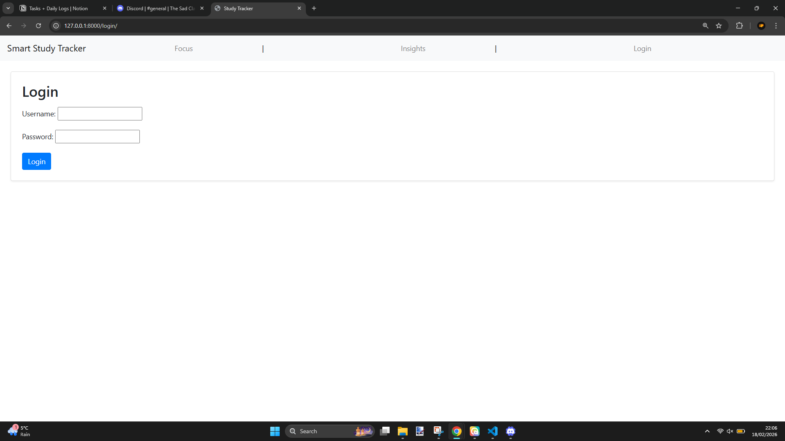

2. **Register page**:
    - 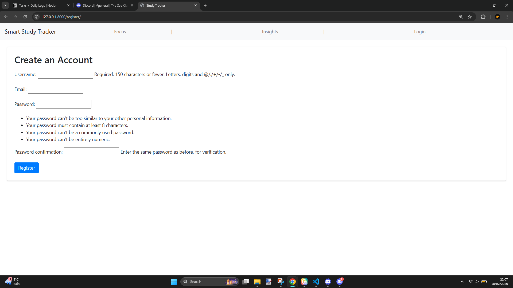

3. **Homepage + sidebar tree populated (Subjects → Modules → SubModules visible)**:
    - 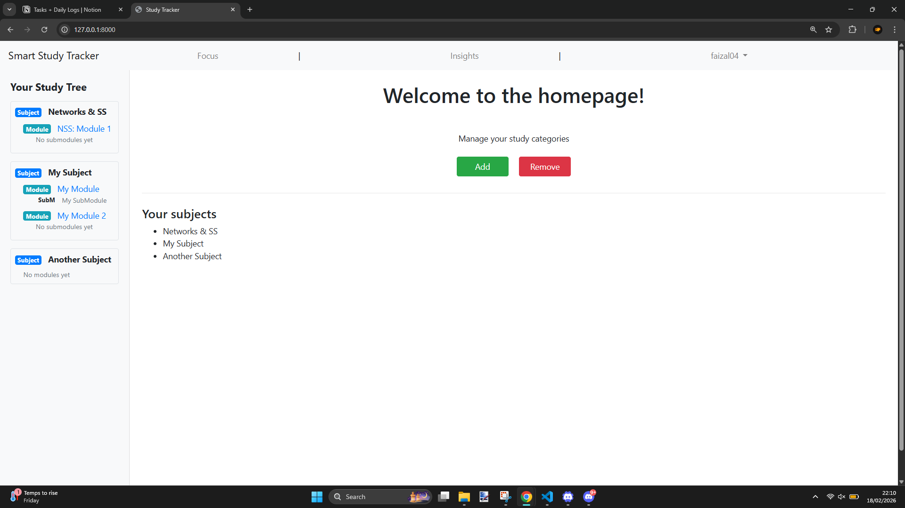

4. **Add Category modal (show choosing Subject/Module/SubModule)**:
    - 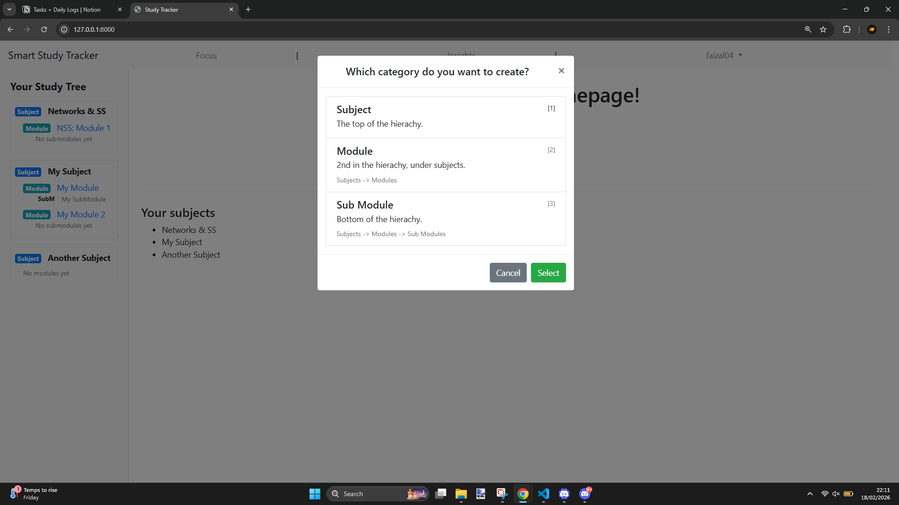

5. **Remove Category modal (show choosing Subject/Module/SubModule)**:
    - 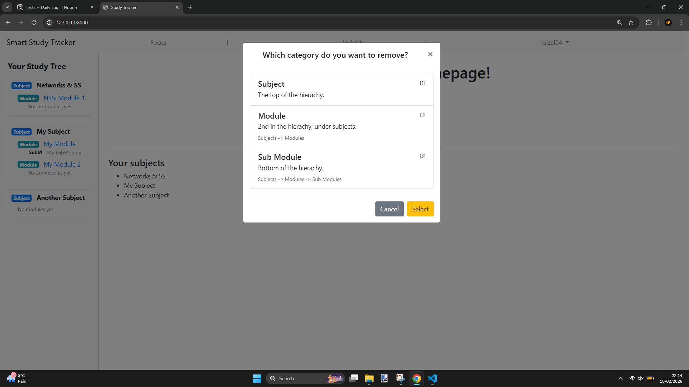

6. **Add/Remove a Subject/Module/SubModule confirmations**:
    - 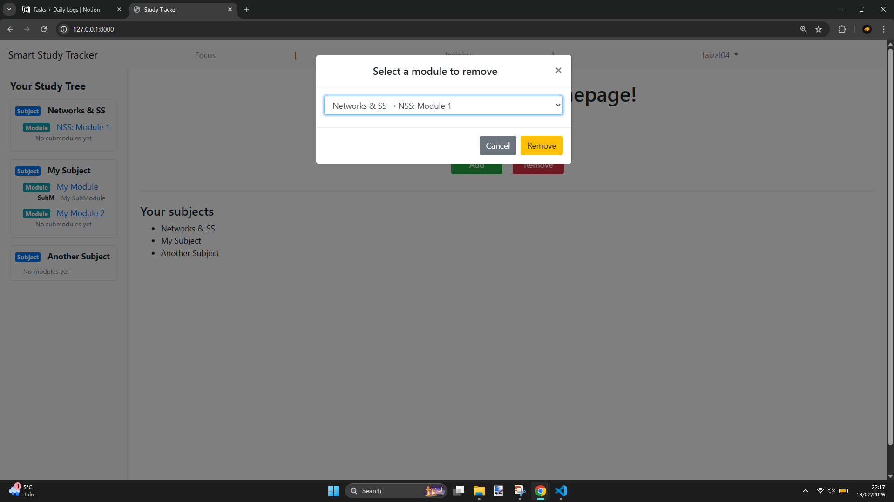
    - 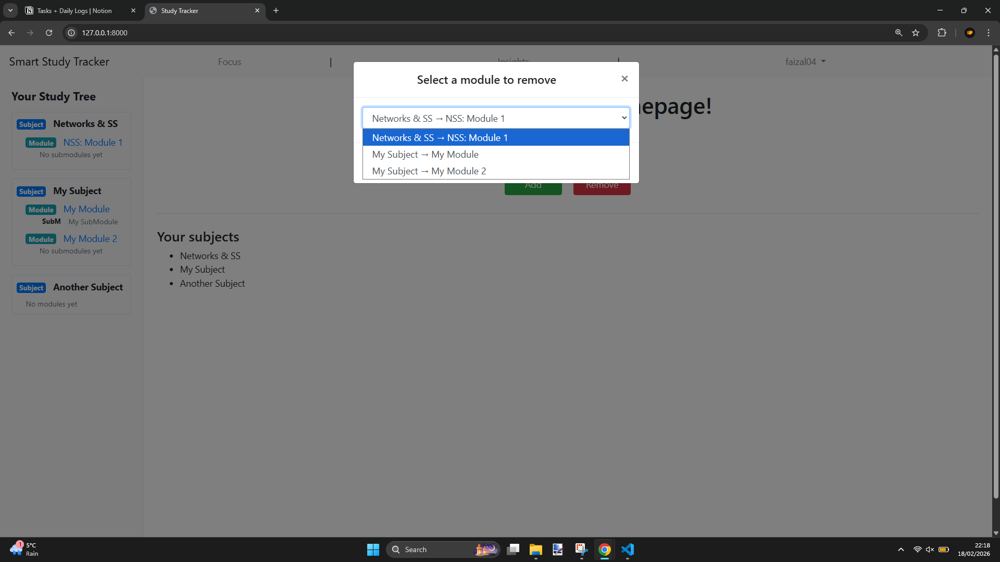
////////////\\\\\\\\\\\\\\\\\\\
*The adding of types:*
    - 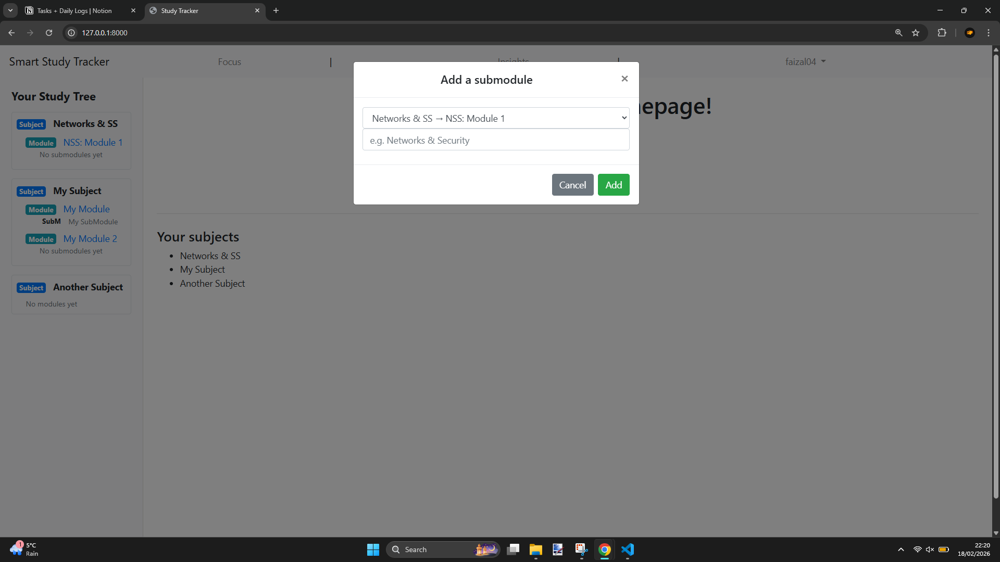
    - 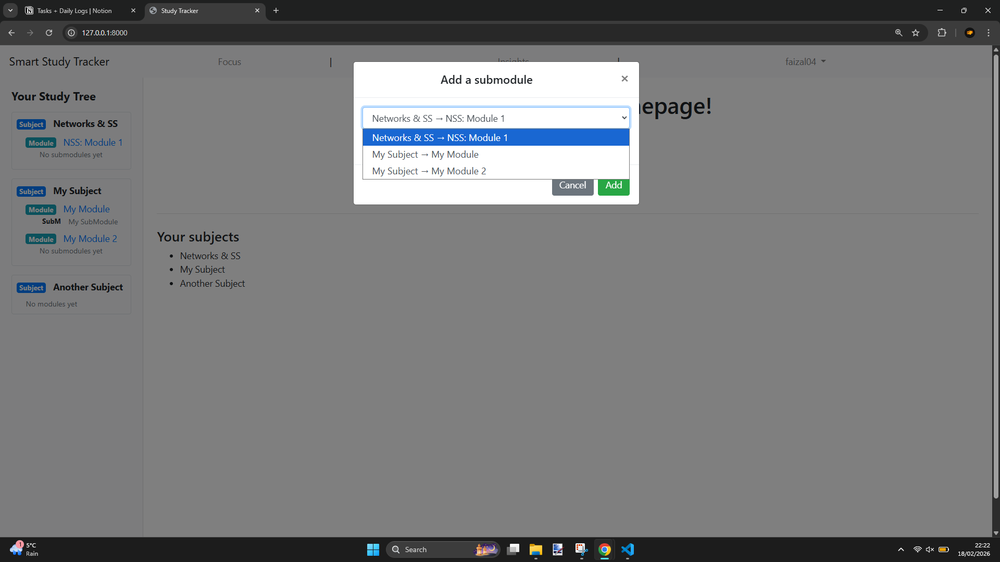
7. **Focus page before starting (subject selection dropdown visible)**:
    - 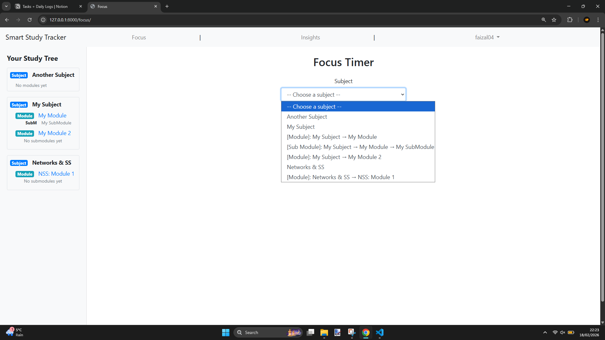

8. **Timer running (show Pause state)**
    - 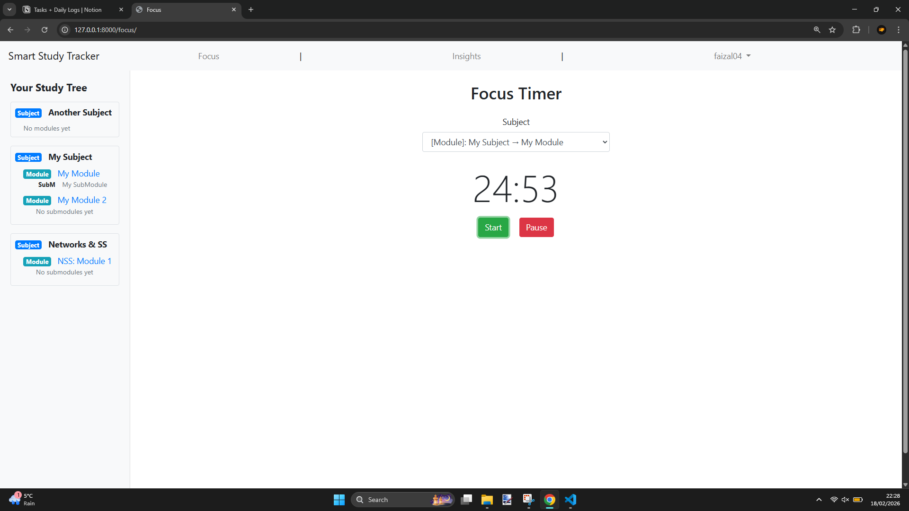

9. **Stop → “Saved ✅” status (proof session logging works)**
    - 

10. **Insights page showing**:
- last 7 days, all time hours & ranked subjects table
        - 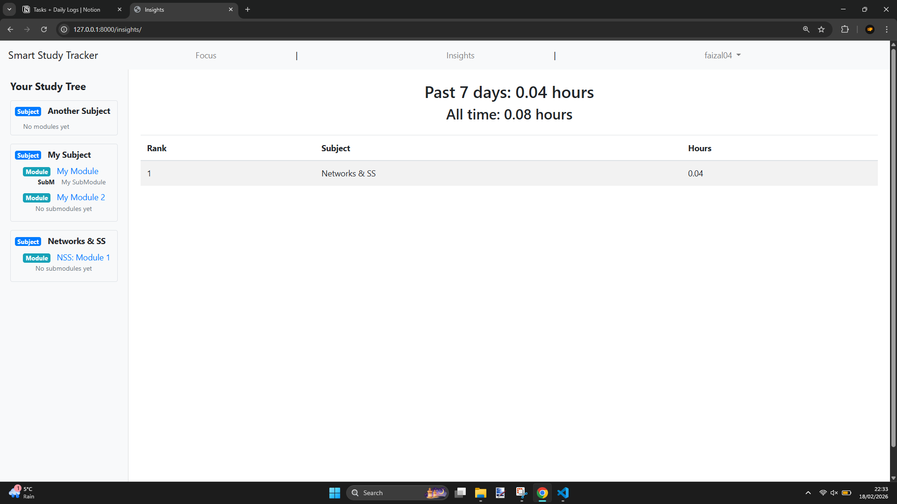

## “Proof” / technical credibility screenshots

11. **Django Admin showing StudySession rows in the database**
    - [*screenshot*]
12. **Browser DevTools → Network tab showing POST to:**
    - `/api/sessions/create/` returning `{ ok: true }`
        - 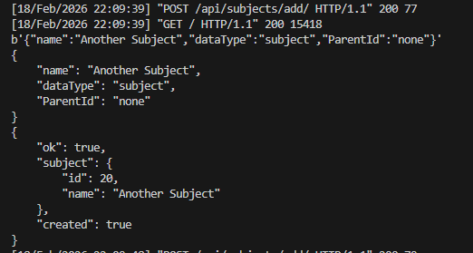

13. **DB file exists (db.sqlite3)**
    - [*screenshot*]