# Test 1
> A little unorganised, but the aim for Test 1 is to run through the entire web app. Starting on every single homepage feature, then moving onto the other pages (focus) and then wrapping it up with login / logout.
>   - In Test 2 I'll have to provide special cases + test data (e.g what happens if an integer is too high? And maybe simulate all kinds of users)

**Test 1 outline**:
1. [A - F]: Add button on homepage
2. [G - I]: Remove button on homepage
3. [J - P]: Focus page (dropdown, start, pause, stop, db updated)
4. [Q - Q]: Insights page (though testing this is useless through my current means, it'll be of use when I create user dummies)
5. [R - T]: Login + Logout + Register

__Test 1A: Adding Subject__
Subject name: `SUBJECT NAME`
Subject added to DB: Yes
Evidence: 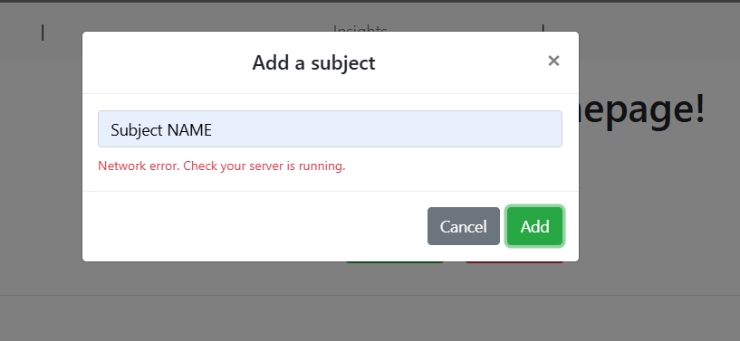
Notes:
> For some reason, it displayed "error - check if server is running". The backend logic works, but it seems to not be in sync with the frontend somehow.
> Sidebar updates automatically (no need to reload) - good
**{-}**

__Test 1B: Adding a subject with a matching name as an already existing subject__
Subject name: `My Subject` (it already exists, both on sidebar and on DB)
Notes:
> When I add it via the web: Currently I didn't fix the issue from Test 1A. But that front end issue aside, on the terminal it seems to be adding a duplicate or some sort? I'll have to query the database to see properly
> No duplicates appear on the sidebar even after reloading - which is a good sign. The sidebar doesn't distinguish subjects by name, rather by id, so duplicates in theory would appear on the sidebar
Evidence: 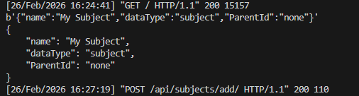

__Test 1C: Adding Module__
Module name: `Module` (under `Subject NAME`)
Module added to DB: Yes
Evidence (if any): 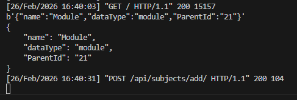
Notes: 
> Worked as expected. No issues.

__Test 1D: Adding a Module with the same name as another module under the same Subject__
Module name: `Module` (under `Subject NAME`) (EXISTS already, as per test 1C)
Module added to DB: Doesn't seem like it
Notes:
> Evidence same as 1C. However, just like 1B, nothing appears on the sidebar which may be a good sign. I'll test this on test 2.

__Test 1E: Adding a Sub Module__
Sub Module name: `Sub Module` which is under `Module` (under Subject `Subject NAME`)
Sub Module added to DB: YES (no page reload required)
Evidence (if any): 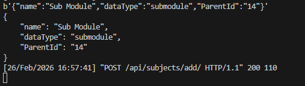
Notes:
> Worked as expected, no issues.

__Test 1F: Duplicate Sub Module under the same ancestry__
Sub Module name: `Sub Module` which is under `Module` (under Subject `Subject NAME`) => Already exists as per 1E
Sub Module added to DB: Appears in terminal again, but doesn't seem like it (nothing on sidebar after reloading)
Evidence: same as 1E just repeated
Notes:
> Again, will have to be tested on test 2

__Test 1G: Removing Subjects__
Subject to be removed: `Subject NAME`. It has children (modules, submodules).
Subject removed: Yes (+ sidebar automatically updated)
Evidence: 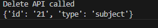

__Test 1H: Removing Modules__
*I'll create a new subject, `Subject` and then a new Module under it, `Module`, and delete the Module*
Module to be removed: `Subject`.`Module`
Module removed from DB: YES
Evidence: 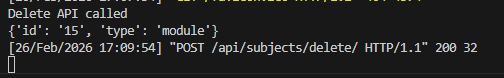
Notes:
> Whilst you don't need to reload for the sidebar to update, there are other places where you need to reload for. In the remove/add boxes (modals) they aren't updated unless the page is reloaded. This is one example, there could be examples in the future. I think from here on out I need to find a way to automatically update everything centrally OR force reload again until further notice.

__TEST 1I: Removing Sub Modules__
*I'll create a new subject, `Subject` and then a new Module under it, `Module` and a Sub Module underneath it, `Sub Module`*
Module to be removed: `Subject`.`Module`.`Sub Module`
Sub Module removed from DB: YES
Evidence: 
Notes:
> No new issues that haven't been addressed already (1h). That aside, it works fine.

__TEST 1J: Focus page dropdown (does it display all s/m/sm?)__
- Yes
- Evidence:
    - 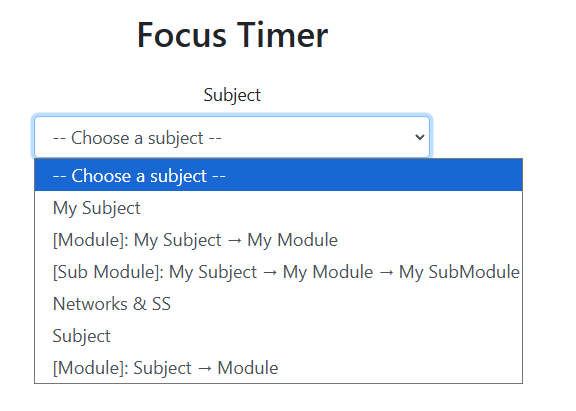
- Notes:
    - > Functionality works as expected but the UX / design sucks - it's hard to tell + some text don't appear on the whole dropdown on a 1920x1080p screen.

__TEST 1K: Focus page: Change timer duration__
- 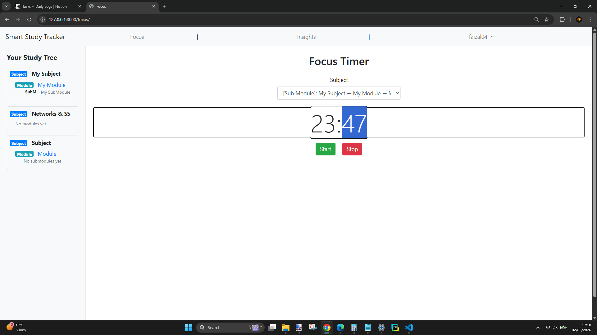
> You can type the duration, even though the user may not find it out due to poor UX

__TEST 1L: Focus page: Change timer duration using invalid formatting / values__
- Invalid values (test: abc)
    - 
> Error message displayed. Even if you press OK, it won't try starting a timer that doesn't follow the correct formatting.

__TEST 1M: Focus page: Start timer__
- Works as expected:
    -  

__TEST 1N: Focus page: Timer duration finished (XX:XX -> 0:00)__
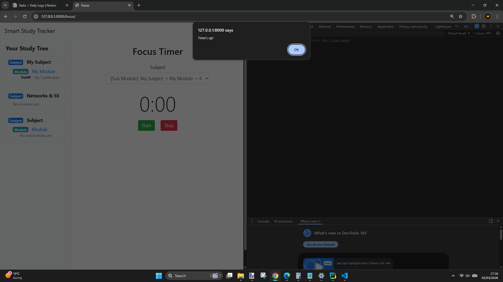
- Works as expected, and once the timer is up it's saved to DB as expected.

__TEST 1O: Focus page: Pause Timer__
- Works as expected. When you pause, you can revert the timer back to it's original value (that the user originally entered) since the pause button becomes stop (whilst the timer is paused, if it isn't paused, the Pause button is Pause)
    - 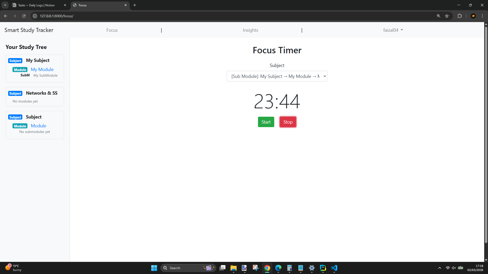

__TEST 1P: Focus page: Stop Timer early__
- Should stop the timer completely (reset back to original time set by user, not to 0) and save the duration.
    - 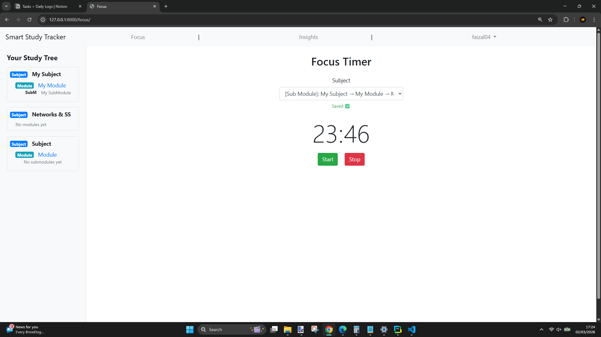 
> Works as expected

__TEST 1Q: Insights page__
- This is currently useless as there's not much data. I'll make a more in-depth one in Test 2.
- Does it display all the intended information?
    - 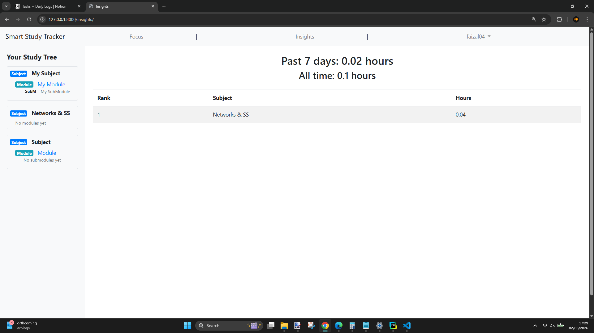 
- Yes it does

__TEST 1R: Login__
- Can user login with their details?
- Are login usernames case sensitive?
    - 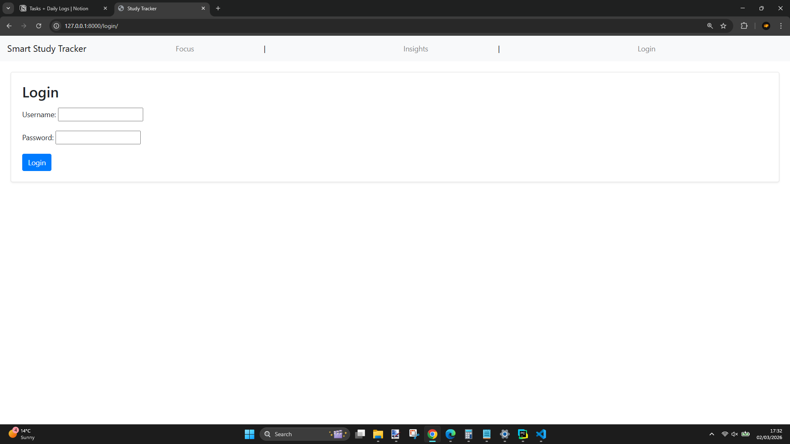 
    - 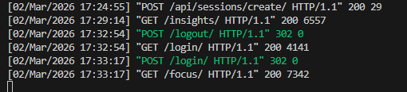
- Works as expected though not really user intuitive

__TEST 1S: Logout__
- No point sending a screenshot of this (not suitable for screenshot format, but it would be for video)
- However it works as intended. You press log out (Whilst logged in) and it redirects you to the login page when you log out

__TEST 1T: Register__
        - 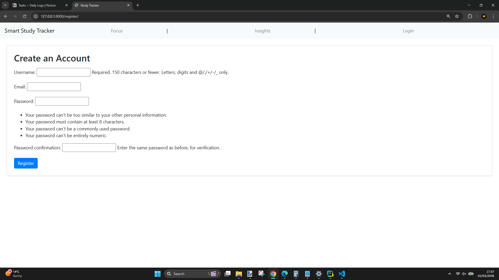
- Maximum characters allowed for username will be lowered from 150 to 20
- Though apart from the above, the logic works fine and does as intended (creates an account, logs a user in, and they can log back in via login when logged out)

# Future additions/fixes:
- In future tests, use the following structure:
    - Test title / name
    - Test Goal / expected outputs
    - Screenshot
    - Whether or not the goal / expected outputs were recieved
- Red warning text on add modal keeps appearing "randomly". This should easily be fixable.
- When adding a s/m/sm, allow the user to hit the `enter` key as well for faster addition.
- On the Focus Timer's dropdown (where you select s/m/sm), it's UX is poorly done - the text (as shown in Test 1J) isn't clear and it falls out of the box itself due to it's redundant nature. Try make the dropdown similar to the sidebar in design
- Passwords
- No register button (currently have to access by typing a URL)
- Currently when stopping the focus timer, it would reset back to original user set duration and save whatever thus far. What if the user makes a mistake (e.g: misclick start) and doesn't want to save that?
    - I think I should add a feature, or a checkbox where it's something of the sort "Automatically save sessions on stop". If this is enabled, it works as it currently does. If it isn't, it would prompt the user the option to save the session, whilst also showing the duration and the s/m/sm they were doing.

Whitespace (small visual error):
    - 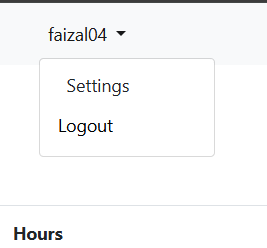